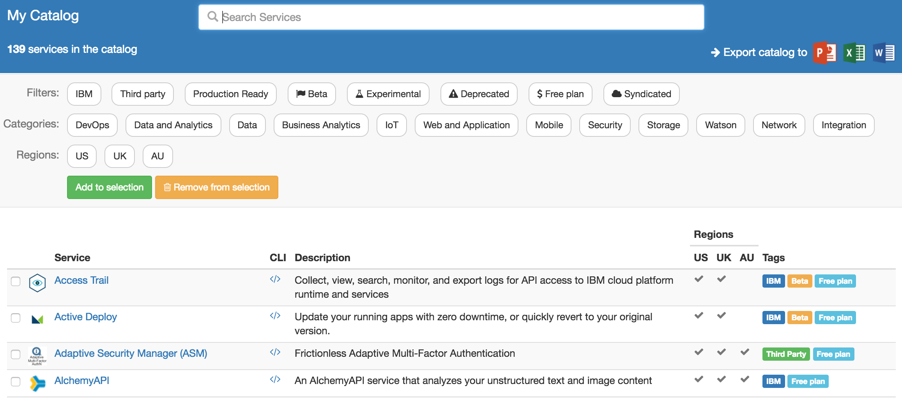

# A simple user interface to view all Bluemix services and export its content as Office documents

My Catalog uses Cloud Foundry API to show an aggregated view of all services from the IBM Bluemix catalog.

## License

My Catalog is licensed under the Apache License Version 2.0 (http://www.apache.org/licenses/LICENSE-2.0).